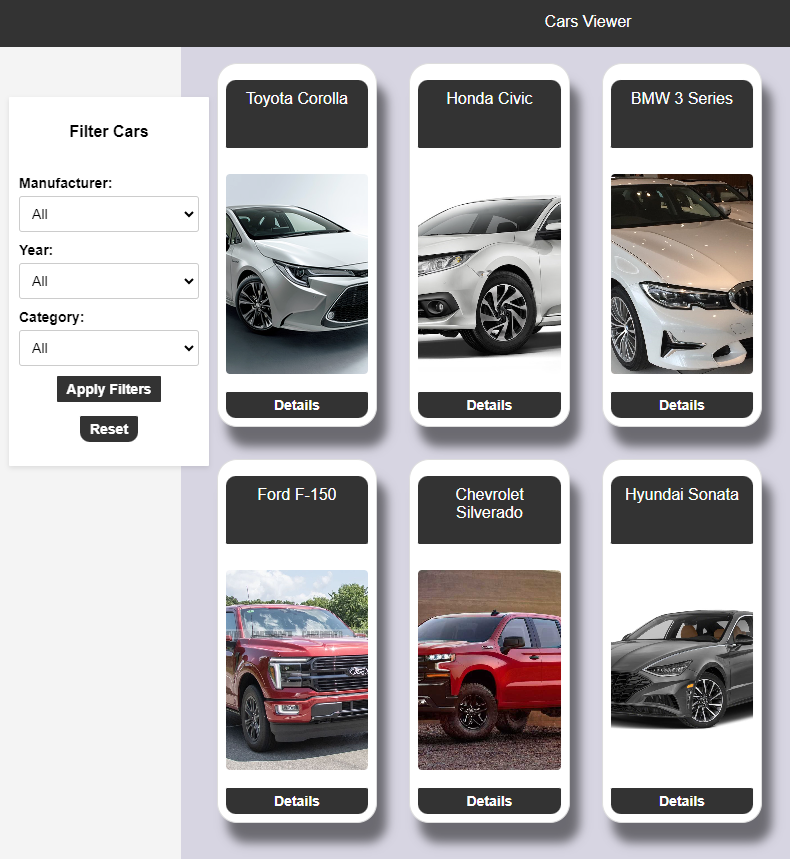

# Cars Viewer



## How To Use

### Before starting the program:

### 1. You need this files for it to work:
- api folder
- gofiles folder
- static folder
- go.mod
- main.go
- README.md

you need to install NodeJS and npm to run this, read the readme in api folder.


### how to run server:

1. build main.go:

```
go build main.go

```

2. run main.go:
```
./main
```

3. how to close server:

```
Ctrl+C
```
4. open browser and type

```
localhost:8080
```

### Coders

Laura Levistö - Jonathan Dahl - 6/24
